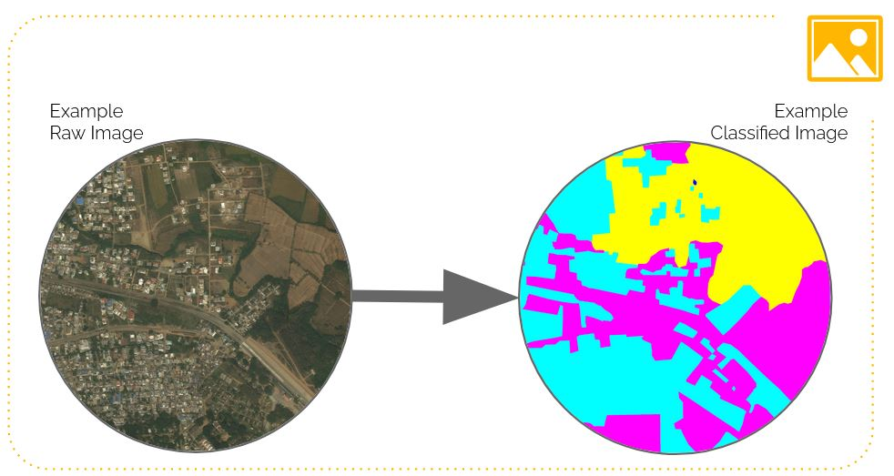
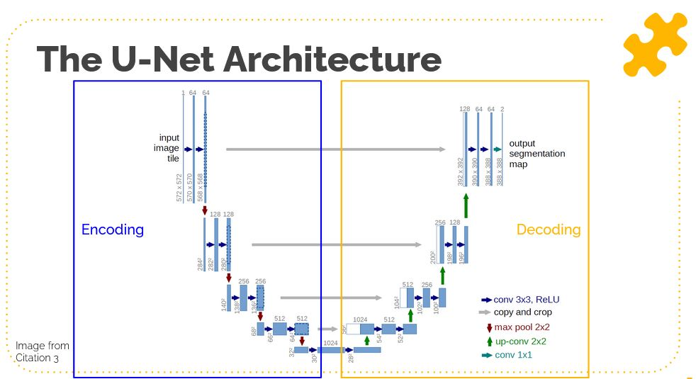
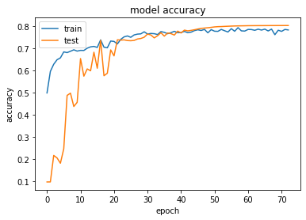
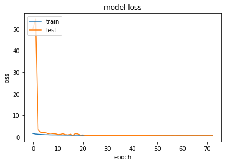
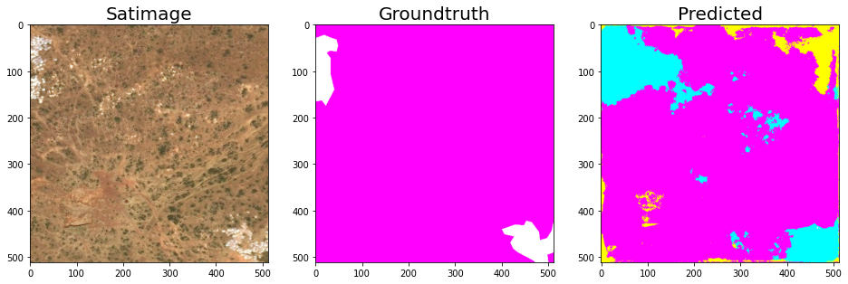
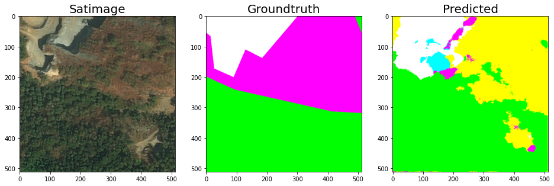
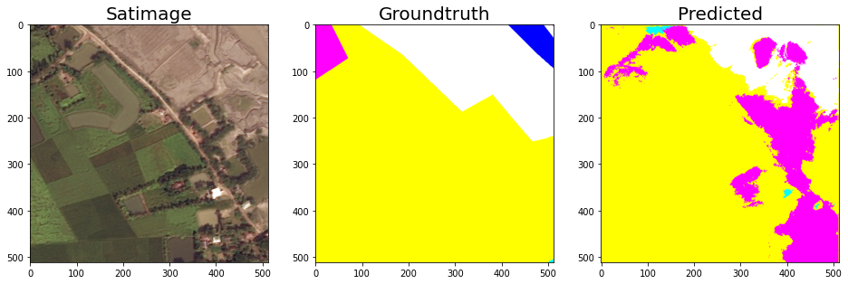
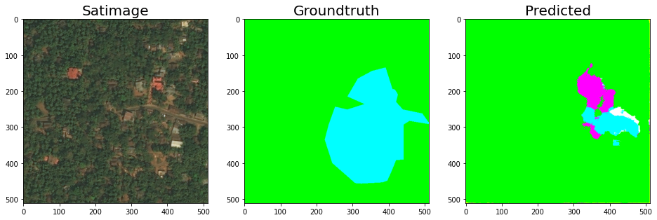
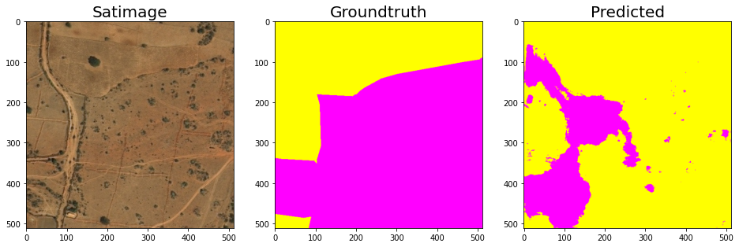

# Land-use classification using Semantic Segmentation
Johnathan Clementi & Gianluca Mangiapane
Remote Sensing: MUSA 650, Spring 2022

### About the problem
Land Use/Land Cover (LULC) data are an important input for ecological, hydrological, and agricultural models [1]. The National Land Cover Database (NLCD) is developed by the USGS from Landsat imagery. [2] However, these data have traditionally have large temporal gaps (~5 years) as they are computationally intensive to create. More temporally granular land cover data are needed for a studying a rapidly changing environment.

**So, how can we access more temporally granular land cover data?**

We believe we can solve the problem through the use of Semantic Segmentation, a form of dense prediction where every pixel in an image is given a label of a corresponding class. Semantic Segmentation has become prevalent in both the medical field as a way of identifying harmful cells from healthy cells in brain and organ scans, and autonomous driving cars being able to identify free road space from other vehicles, pedestrians, and road signs. However, there has also been a growing application of Semantic Segmentation to the field of Remote Sensing and identifying different classes of land use and objects from satellite imagery.

### Summary of Results
We trained three iterations of the standard U-Net Archicture on this land cover classification problem uisng a trimmed and cropped dataset containing 500 images. We found that the model with the highest accuracy correctly identifies 80.03% of an the pixels within the testing set. If you'd like to learn more about our project, please check out the [slide deck](https://docs.google.com/presentation/d/1aZLCAMFDXPVobkQbG2JTiNcn0NmERWRE0zgXl6Hu5lg/edit?usp=sharing) or the [report](clementi_mangiapane_finalPrj.pdf). 

#### Testing accuracy and loss from our best model:

#### Example resulting images from our best model:

Thank you for your interest in our work!